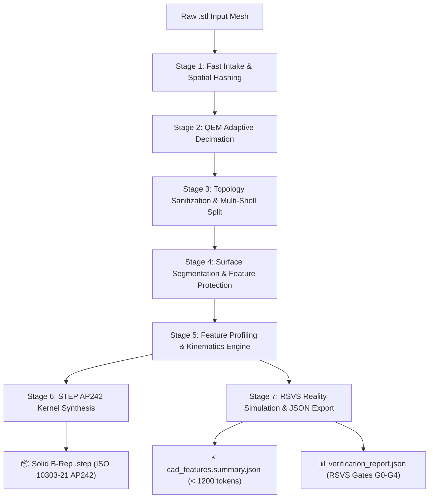

<div align="center">

# ⚙️ ReverseCAD: Industrial-Grade STL ➔ STEP AP242 + CAD Features JSON Engine

[](https://www.typescriptlang.org/)
[](https://nodejs.org/)
[]()
[]()
[]()
[](https://modelcontextprotocol.io)
[]()
[]()
[](LICENSE)
[](COMMERCIAL.md)

<br />

**High-performance deterministic reverse engineering pipeline and Model Context Protocol (MCP) server that transforms raw unstructured `.stl` polygon meshes into production-grade solid B-Rep models (STEP AP242 / ISO 10303-21) and compact CAD Features JSON (<1200 tokens) in seconds — featuring sub-micrometer fidelity, zero V8 Heap thrashing, non-destructive thread/chamfer preservation, and mathematical RSVS reality simulation.**

[🚀 Quick Start](#-quick-start--cli-usage) • [🏗️ System Architecture](#️-system-architecture-7-stage-pipeline) • [💻 Cross-Platform](#-cross-platform--architecture-support) • [🤖 MCP Server for AI](#-model-context-protocol-mcp-server) • [🔬 RSVS Simulation](#-rsvs-reality-simulation-engine) • [🏢 Commercial License](COMMERCIAL.md) • [👨‍💻 Author & Collaboration](#-author--collaboration)

</div>

---

## 📑 Table of Contents

- [Executive Overview](#-executive-overview)
- [Key Engineering Capabilities](#-key-engineering-capabilities)
- [System Architecture (7-Stage Pipeline)](#️-system-architecture-7-stage-pipeline)
- [Cross-Platform & Architecture Support](#-cross-platform--architecture-support)
- [Multithreading & Resilience Engine](#-multithreading--resilience-engine)
- [Quick Start & CLI Usage](#-quick-start--cli-usage)
  - [1. Installation & Build](#1-installation--build)
  - [2. Single File Conversion](#2-single-file-conversion)
  - [3. Custom Output Directory](#3-custom-output-directory)
  - [4. High-Throughput Batch Processing](#4-high-throughput-batch-processing)
  - [5. Specialized Execution Modes](#5-specialized-execution-modes)
- [Output Artifacts & The Two-File Rule](#-output-artifacts--the-two-file-rule)
- [Model Context Protocol (MCP) Server](#-model-context-protocol-mcp-server)
  - [Why ReverseCAD MCP is Enterprise-Grade](#why-reversecad-mcp-is-enterprise-grade)
  - [Available MCP Tools Catalog](#available-mcp-tools-catalog)
  - [Client Configurations (Claude Desktop, Cursor, Trae, Antigravity)](#client-configurations)
- [RSVS Reality Simulation Engine](#-rsvs-reality-simulation-engine)
- [Automated Verification & Test Suite](#-automated-verification--test-suite)
- [Author & Collaboration](#-author--collaboration)
- [License & Commercial Terms](#-license--commercial-terms)

---

## 🎯 Executive Overview

For over three decades, computer-aided engineering has struggled with a fundamental divide:
* **The Mesh World (`.stl`):** A lossy, unorganized "raster snapshot" consisting of raw 3D triangles without topology, cylinder equations, radii, centers, or manufacturing semantics.
* **The CAD World (`.step`, B-Rep):** Exact mathematical boundary representations (surfaces, curves, vertices, faces) capable of parametric editing, assembly mating, and CAM toolpath generation.

Traditional solutions fall into two extremes:
1. **Crude "Facet Wrappers" (FreeCAD, OpenCASCADE, online converters):** Wrap every single STL triangle into a STEP face, bloating a 5 MB STL into a 250 MB STEP that freezes SolidWorks, Fusion 360, and slicers, while providing zero analytical cylinders or mating references.
2. **Expensive, Manual Reverse Engineering (Geomagic Design X, CATIA):** Costing upwards of \$25,000/license and requiring an experienced engineer to spend 2 to 8 hours per part clicking surfaces and redrawing sketches. Their automated "Autosurface" functions smear sharp edges and ruin threads into wavy NURBS patches.

**ReverseCAD bridges this divide deterministically in seconds.** By combining multi-surface RANSAC segmentation with strict non-destructive feature validators, ReverseCAD extracts exact analytical primitives (planes, cylinders, cones, tori) while preserving micro-mechanical geometry (helical threads, 45° entrance chamfers, knurling) 1:1 as continuous B-Rep facet shells.

---

## ✨ Key Engineering Capabilities

| Engineering Feature | Detection Algorithm | Representation in STEP & CAD JSON |
|---|---|---|
| 🔩 **ISO Metric Threads (M2–M24)** | ISO/DIN standard catalog lookup, coaxial cylinder detection, pitch $P$, and flank analysis. | **STEP:** Exact tap drill cylinder (`THREADS_*` layer, magenta color).<br />**JSON:** `spec: "M6x1", pitchMm: 1.0, tapDrillDiameterMm: 5.0`. |
| 🛡️ **Curved Feature & Thread Protection** | 3-factor validation (`plane-feature-validator`): compactness ($\ge 0.015$), normal collinearity ($\le 1.0^\circ$, RMS $\le 0.6^\circ$). | Eliminates sickle cuts across 45° conical entrance chamfers and preserves thread crests 1:1 without artificial planar flattening. |
| 🕳️ **Internal Hidden Cavities** | Gauss-Ostrogradsky signed divergence volume integration per closed manifold shell ($V < 0$). | Internal cooling channels, lattices, and hollow chambers remain 100% empty and are never filled during slicing. |
| 📏 **Print-in-Place Kinematic Clearances** | Coaxial cylindrical & prismatic joint detection with radial play calculation. | Quantifies exact gap $\|R_{\text{sleeve}} - R_{\text{shaft}}\|$. Prevents moving joints from fusing during 3D printing. |
| 🔲 **Holes & Counterbores** | Cylindrical depression classifier with outward/inward normal orientation checks. | True analytical `CYLINDRICAL_SURFACE` entities that snap into CAD systems for immediate mates and concentric constraints. |
| 📐 **Analytical Quadric Surfaces** | Multi-surface RANSAC: planes, bounded cylinders with circular endcaps, cones, tori. | Sub-micrometer residual deviation ($< 0.005$ mm), reducing STEP file size up to 10× compared to raw facet models. |
| 🔬 **RSVS Reality Simulation** | 5 reality verification gates (G0–G4): Hausdorff metric (H99), volume error, Euler invariant ($\chi = 2 - 2g$). | Rigorous pre-manufacturing geometric sign-off before sending code to CNC mills or 3D printers. |

---

## 🏗️ System Architecture (7-Stage Pipeline)



1. **Stage 1 (Fast Intake & 64-bit Spatial Hashing):** Auto-detects Binary vs. ASCII STL formats. Uses a collision-free 64-bit spatial coordinate hash for vertex welding without string allocation or V8 GC overhead.
2. **Stage 2 (Adaptive Decimation):** Quadric Error Metric (QEM) edge-collapse decimation simplifies planar regions while locking boundary loops and high-curvature feature lines.
3. **Stage 3 (Topology Sanitization):** Validates manifold watertightness, repairs T-junctions, discards degenerate sliver triangles, and separates disjoint bodies into independent shells.
4. **Stage 4 (Surface Segmentation & Feature Protection):** RANSAC extraction for planes, cylinders, cones, and tori. Validates plane candidates against spatial compactness and angular dispersion to protect 45° chamfers and helical thread crests.
5. **Stage 5 (Feature Profiling & Kinematics Engine):** Matches holes to ISO metric standards, extracts bolt circle pitch diameter circles (PCD), and quantifies Print-in-Place kinematic joints.
6. **Stage 6 (STEP AP242 Kernel):** Direct synthesis of STEP AP242 ISO 10303-21 B-Rep entities via 256 KB buffered streaming I/O, with automatic IEEE 754 negative zero (`-0.0`) sanitization.
7. **Stage 7 (RSVS Reality Simulation & Dual JSON Export):** Zero-Heap scalar calculation of Hausdorff distance percentiles (H99), Mirtich polyhedral mass integration, and dual-tier JSON generation.

---

## 💻 Cross-Platform & Architecture Support

ReverseCAD is engineered using pure standard Node.js runtime APIs, portable typed memory buffers (`Float32Array`), and cross-platform Worker Threads. It runs seamlessly with **0 native compilation prerequisites** across all desktop, workstation, and cloud server environments:

* **Operating Systems**:
  * 🍏 **macOS** (macOS 12+ Monterey, Ventura, Sonoma, Sequoia) via `./convert.sh`
  * 🐧 **Linux** (Ubuntu, Debian, Fedora, Arch, Alpine, RHEL) via `./convert.sh`
  * 🪟 **Windows** (Windows 10, 11, Server via PowerShell `.\convert.ps1`, Command Prompt `convert.cmd`, or WSL2 / Git Bash)
* **CPU Architectures**:
  * ⚡ **ARM64 / AArch64** (Apple Silicon M1/M2/M3/M4 with automatic P-Core affinity, Qualcomm Snapdragon X Elite, AWS Graviton, Raspberry Pi 5)
  * ⚡ **x86_64 / AMD64** (Intel Core / Xeon, AMD Ryzen / EPYC with multithreaded worker pool)

### Platform & Shell Matrix

| Platform | Shell / Terminal | Command Syntax | Architecture Support |
| :--- | :--- | :--- | :---: |
| 🍏 **macOS** | Zsh / Bash | `./convert.sh model.stl` | **ARM64 (Apple Silicon M1–M4) & x86_64** |
| 🐧 **Linux** | Bash / Sh | `./convert.sh model.stl` | **x86_64 & ARM64 (AArch64)** |
| 🪟 **Windows (PowerShell)** | Windows PowerShell / PS Core | `.\convert.ps1 model.stl` | **x64 & ARM64 (Snapdragon X)** |
| 🪟 **Windows (CMD)** | Command Prompt (`cmd.exe`) | `convert.cmd model.stl` | **x64 & ARM64** |
| 🪟 **Windows (WSL / Git Bash)** | Bash | `./convert.sh model.stl` | **x64 & ARM64** |
| 🌐 **Universal NPM** | Any Terminal (All Platforms) | `npm run convert -- model.stl` | **Universal** |

---

## ⚡ Multithreading & Resilience Engine

* **Piscina Worker Threads Pool:** Maximizes CPU saturation by dynamically detecting Performance cores on Apple Silicon (M1–M4) and multi-core Intel/AMD architectures, configured with explicit memory limits (`maxOldGenerationSizeMb: 4096`).
* **Deficit Weighted Round-Robin (DWRR):** Fair-share batch scheduler ensures small parts are never starved when processing giant multi-million triangle meshes simultaneously.
* **Memory Circuit Breaker & Watchdog Guard:** Proactive Heap allocation monitoring trips gracefully before reaching Out-of-Memory thresholds. An adaptive execution watchdog kills and reports corrupt/infinite-loop geometry.
* **Streaming Manifest (`conversion_manifest.ndjson`):** Live step-by-step progress logging in structured NDJSON for automated CI/CD monitoring.

---

## 💻 Quick Start & CLI Usage

### 1. Installation & Build

```bash
# Clone repository
git clone https://github.com/grizlizora/reverse-cad.git
cd reverse-cad

# Install dependencies and build TypeScript
npm install
npm run build

# Make launcher executable (macOS / Linux only)
chmod +x ./convert.sh
```

### 2. Single File Conversion

#### macOS & Linux:
```bash
./convert.sh ./models/bracket_m6.stl
./convert.sh "/path/to/part.stl" -o ~/Downloads/
```

#### Windows (PowerShell):
```powershell
.\convert.ps1 .\models\bracket_m6.stl
.\convert.ps1 "C:\path\to\part.stl" -o "$HOME\Downloads"
```

#### Windows (Command Prompt):
```cmd
convert.cmd models\bracket_m6.stl
convert.cmd "C:\path\to\part.stl" -o "%USERPROFILE%\Downloads"
```

#### Universal NPM (Any Platform):
```bash
npm run convert -- ./models/bracket_m6.stl -o ./output
```

### 3. Custom Output Directory (`-o` / `--out-dir`)

By default, converted models are saved to `./output`. You can route output to any directory across platforms:

```bash
# Save to Downloads (macOS/Linux)
./convert.sh "model.stl" -o ~/Downloads/

# Save to Downloads (Windows PowerShell)
.\convert.ps1 "model.stl" -o "$HOME\Downloads"

# Save to custom engineering workspace
npm run convert -- "model.stl" -o ./cad_exports/
```

### 4. High-Throughput Batch Processing

```bash
# macOS / Linux: batch convert directory with 8 parallel worker threads
./convert.sh ./models/ -o ./output/ -t 8

# Windows (PowerShell):
.\convert.ps1 .\models\ -o .\output\ -t 8

# Universal NPM:
npm run convert -- ./models/ -o ./output/ -t 8
```

### 5. Specialized Execution Modes

```bash
# Fast AI inspection: generate semantic JSON only (skips heavy STEP generation)
./convert.sh part.stl --json-only

# Pure CAD conversion: generate solid STEP file only
./convert.sh part.stl --step-only

# Run full RSVS benchmark suite, mutation injection & memory leak audits
./convert.sh --test
# (or on Windows: .\convert.ps1 --test  /  npm test)
```

---

## 📁 Output Artifacts & The Two-File Rule

Upon pipeline completion, the target directory contains a clean, production-ready set of files:

```
├── 🟢 part.step                      <- PRIMARY FOR CAD & SLICERS (Solid B-Rep model)
├── 🟢 part.cad_features.summary.json <- PRIMARY FOR AI LLMS (< 1200 tokens, full semantics)
├── ⚪️ part.cad_features.topology.json<- Full geometric dump (vertices, facets, bounds)
├── ⚪️ part.verification_report.json  <- RSVS G0-G4 reality simulation report
└── ⚪️ conversion_manifest.ndjson      <- Real-time pipeline execution log
```

### 💡 The Two-File Rule for Users & Engineers:
1. 🟢 **`*.step`** ➔ Open directly in Autodesk Fusion 360, SolidWorks, FreeCAD, Shapr3D, Siemens NX, or 3D slicers (Bambu Studio, PrusaSlicer, OrcaSlicer).
2. 🟢 **`*.cad_features.summary.json`** ➔ Attach to your chat with Claude, GPT-4o, Cursor, or Gemini. Contains complete mechanical semantics (threads, holes, mass, bounding box, kinematics) without consuming LLM context window limits.

---

## 🤖 Model Context Protocol (MCP) Server

ReverseCAD features a built-in enterprise-grade **MCP Server** that exposes deterministic CAD reverse engineering tools directly to AI coding environments (Claude Desktop, Cursor, Trae, Windsurf, Antigravity).

### Why ReverseCAD MCP is Enterprise-Grade:
* **Zero Event Loop Latency (< 0.02 ms Ping SLA):** Heavy geometric calculations run entirely within background worker threads. The main process handles only asynchronous Stdio transport, guaranteeing instant `ping` responses even while processing 100 MB meshes.
* **Strict Stdio Framing Isolation:** All internal logs, worker stdout, and warnings are redirected to `stderr`. This prevents invalid characters in `stdout` and eliminates `-32700 JSON Parse Errors`.

### Available MCP Tools Catalog:

| Tool Identifier | Input Parameters | Description |
|---|---|---|
| `cad_analyze_stl` | `filePath: string` | Fast geometric audit: triangle count, dimensions, watertightness, signed volume, and cavity detection. |
| `cad_detect_threads` | `filePath: string` | Scans for standard ISO/DIN metric threads (M2–M24), returning thread pitch, tap drill diameter, and depth. |
| `cad_verify_rsvs` | `filePath: string` | Executes RSVS reality simulation gates (G0–G4) and computes Hausdorff distance percentiles. |
| `cad_convert_to_step` | `filePath: string`, `outputDir?: string` | Complete end-to-end pipeline: synthesizes solid STEP AP242 and generates dual-tier CAD JSON. |

### Client Configurations

#### 1. Claude Desktop (`claude_desktop_config.json`)
```json
{
  "mcpServers": {
    "reverse-cad": {
      "command": "/bin/bash",
      "args": [
        "/absolute/path/to/reverse-cad/convert.sh",
        "--mcp"
      ]
    }
  }
}
```

#### 2. Cursor IDE (`.cursor/mcp.json`)
```json
{
  "mcpServers": {
    "reverse-cad": {
      "command": "/bin/bash",
      "args": [
        "/absolute/path/to/reverse-cad/convert.sh",
        "--mcp"
      ]
    }
  }
}
```

---

## 🔬 RSVS Reality Simulation Engine

ReverseCAD includes a proprietary **Reality Simulation Verification Suite (RSVS)** that verifies geometric fidelity against the original STL mesh:

* **David Eberly 3D Triangle Projection:** Calculates exact scalar distances from any point in space to a 3D triangle across all 7 Voronoi zones directly from contiguous `Float32Array` buffers.
* **Zero-Heap Scalar Fast-Path:** Eliminates intermediate `{ distance, point }` object allocations in hot loops ($10^6$ sample points), preventing V8 Garbage Collector pauses.
* **Analytical Quadric Math:** Exact analytical distance metrics for planes, finite clamped cylinders with endcaps $d = \sqrt{\Delta r^2 + \Delta t^2}$, cones, and tori.
* **$O(N)$ QuickSelect Percentile Calculation:** Computes the 99th percentile Hausdorff distance ($H_{99}$) in linear time without expensive full-array sorting.

---

## 🧪 Automated Verification & Test Suite

Run the full end-to-end regression and verification suite:

```bash
./convert.sh --test
```

### Verified Suite Coverage:
* **4 Procedural Industrial Benchmarks:** Prismatic M6 bracket, hollow internal labyrinth, Print-in-Place hinge, and organic saddle surface.
* **Mutation Self-Test:** Injects 4 intentional geometric mutations (axis tilt, scaling distortion, wall rupture, clearance collapse) and confirms 100% detection by RSVS reality gates.
* **Combinatorial Matrix Scanner:** Stress tests dense 80,000 and 40,000 triangle procedural meshes.
* **Zero-Leak Memory Audit:** Verifies zero dangling `ArrayBuffer` allocations with Heap growth strictly $< 0.7$ MB.

```
======================================================
  RSVS REALITY SIMULATION & GROUND-TRUTH TEST BENCHMARK
======================================================

• Testing procedural model: benchmark_prismatic_m6.stl
  ✔ Successfully converted in 22 ms
  ✔ Analytical surfaces extracted: 10
  ➜ RSVS Gates: [G0: PASSED] [G1: PASSED] [G2: PASSED] [G3: PASSED] [G4: WARNING]
  ✔ M6 thread detection: CONFIRMED

• Testing procedural model: benchmark_internal_labyrinth.stl
  ✔ Internal cavity detection (Zero-Voxel): CONFIRMED

• Testing procedural model: benchmark_pip_hinge.stl
  ✔ Print-in-Place clearance detection: CONFIRMED

• Running RSVS mutation self-test (4 injected defects)...
  ✔ Detected 4/4 defects

✔ Memory Audit Clean: No lingering ArrayBuffer leaks detected.
======================================================
  ✔ ALL TESTS PASSED SUCCESSFULLY! PIPELINE 100% VALID.
======================================================
```

---

## 👨‍💻 Author & Collaboration

Crafted by **Roman ([@grizlizora](https://t.me/grizlizora))** — Software Engineer specializing in High-Performance Systems, Computational Geometry, Multithreaded Pipelines, and AI Agent Integrations.

* 💬 **Telegram:** [@grizlizora](https://t.me/grizlizora)
* 🐙 **GitHub:** [@grizlizora](https://github.com/grizlizora)
* 💼 **LinkedIn:** [Roman Vaida](https://www.linkedin.com/in/roman-vaida-4873a6287)
* 📧 **Email:** [roma.vaida66@gmail.com](mailto:roma.vaida66@gmail.com)

---

## 📄 License & Commercial Terms

ReverseCAD is released under a **Dual-Licensing Model**:

| License Tier | Target Audience | Terms & Pricing | Rights & Permitted Use |
|:---|:---|:---:|:---|
| 🟢 **Community Edition** | Individuals, Hobbyist Makers, Students, Academic Researchers | **100% Free** | Licensed under [PolyForm Noncommercial 1.0.0](LICENSE). Free for personal 3D printing, university coursework, research, and non-commercial development. |
| 🏢 **Commercial & Enterprise Edition** | For-Profit Companies, 3D Print Farms, CNC Bureaus, CAD/CAM Vendors, SaaS | **$10,000 USD / year** | Mandatory for commercial operations. Grants closed-source integration, full legal indemnification, direct author priority support, and multi-node commercial rights. See [COMMERCIAL.md](COMMERCIAL.md). |

### ⚠️ Legal Enforcement Notice:
Commercial use without an active, paid Commercial License constitutes statutory copyright infringement under international treaties (Berne Convention), Title 17 of the United States Code (17 U.S.C. § 504 statutory damages up to **$150,000 USD per willful infringement**), and European Union Intellectual Property Directives. Pre-trial formal demands and litigation will be actively enforced.

To obtain an official corporate license, request an invoice, or execute a master enterprise agreement:
* **Licensor:** Roman Vaida
* **Email:** [roma.vaida66@gmail.com](mailto:roma.vaida66@gmail.com)
* **Telegram:** [@grizlizora](https://t.me/grizlizora)
* **Terms & Wire Transfer Instructions:** [COMMERCIAL.md](COMMERCIAL.md)
