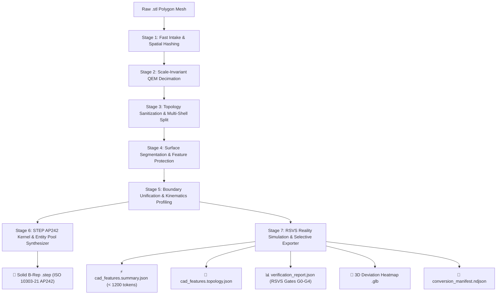
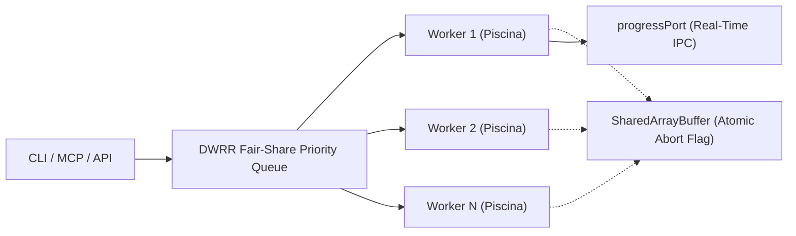

# 🏗️ ReverseCAD System Architecture & Engineering Principles

This document provides a comprehensive technical reference for the internal architecture, mathematical formulations, concurrency models, memory management, and RSVS validation suite powering ReverseCAD.

---

## 📐 1. The 7-Stage Reverse-Engineering Pipeline

### Stage-by-Stage Breakdown

#### Stage 1: Fast Intake & Spatial Coordinate Quantization
* **Auto-Format Detection:** Transparently ingests Binary and ASCII STL files.
* **Spatial Quantization ($10^{-5}$ mm):** Employs 64-bit coordinate keys to deduplicate vertices at sub-micrometer resolution without V8 garbage collection thrashing.
* **Transferable ArrayBuffers:** Byte streams are read into typed buffers and passed across worker threads without deep copying.

#### Stage 2: Scale-Invariant QEM Decimation
* **Quadric Error Metric (QEM):** Collapses coplanar and flank edges based on surface quadrics $Q = \sum (\mathbf{n} \cdot \mathbf{x} + d)^2$.
* **Scale Normalization ($D_{\text{bbox}}$):** Decimation thresholds automatically adapt to the bounding box diagonal, ensuring 0.1 mm micro-holes and 1500 mm structural flanges receive proportional geometric fidelity.
* **Datum & Crease Shields:**
  - **90° Sharp Creases & 45° Chamfers:** Locked against premature collapse.
  - **Datum Plane Locks:** Dedicated guard ensures edges spanning two datum planes (`datumA && datumB`) are constrained to `maxCoplanarLockedLenSq`, preventing dimension shrinkage.

#### Stage 3: Topology Sanitization & Shell Decomposition
* **Flat Half-Edge Connectivity:** Maintains edge-to-triangle incidence via typed flat arrays (`BigInt64Array`), eliminating memory fragmentation.
* **Manifold Healing:** Identifies and repairs degenerate sliver triangles ($Area < 10^{-10}$) and non-manifold vertex pinch points.
* **Shell Decomposition:** Partitions the mesh into independent closed shells and calculates signed volumes via the divergence theorem:
  - $V > 0$: Outer solid body.
  - $V < 0$: Internal hollow cavity or cooling channel.

#### Stage 4: Surface Segmentation & Analytical Quadric Fitting
* **Multi-Surface Localized RANSAC:** Segments mesh triangles into canonical analytical primitives:
  - **Planes:** In-place normal clustering and PCA refinement.
  - **Cylinders:** Coaxial search with scale-dependent spatial sampling.
  - **Cones & Tori:** Quadric curvature matching with axis singularity protection ($rDist < 10^{-12}$).
  - **Freeform:** Fallback B-spline / tessellated patches for organic contours.
* **Coaxial Stitching:** Merges split cylindrical sectors (e.g. halved bores or slotted holes) into unified cylinders.

#### Stage 5: Boundary Unification, Kinematics & Thread Profiling
* **Coplanar Half-Edge Cancellation:** Cancels internal shared edges of coplanar triangle clusters, isolating outer loops and inner hole perimeters.
* **Jordan Face Extraction:** Builds a directed acyclic graph (DAG) of nested contours, correctly nesting complex, non-convex, and C-shaped cutouts.
* **Collinear Vertex Pruning:** Applies 1D Ramer-Douglas-Peucker (RDP) reduction with a $10^{-5}$ mm tolerance.
* **ISO Metric Thread Catalog:** Automatically fits standard metric thread designations (M2 through M24), computing pitch $P$, nominal diameter, and tap drill diameter.

#### Stage 6: STEP AP242 B-Rep Kernel Synthesis
* **ISO 10303-21 Standard Compliance:** Generates fully conforming STEP Part 21 exchange structures.
* **Topological Edge Sharing:** Every interior edge between adjacent faces is represented by a single `EDGE_CURVE`, referenced by forward (`.T.`) and reverse (`.F.`) `ORIENTED_EDGE` descriptors.
* **Geometric Entity Pool:** Deduplicates `CARTESIAN_POINT`, `DIRECTION`, `VECTOR`, and `AXIS2_PLACEMENT_3D` entities with spatial hashing.
* **Buffered Chunk Streaming:** Writes entity blocks in 64 KB / 256 KB chunks, ensuring flat memory consumption even on models with over 2,000,000 faces.

#### Stage 7: RSVS Reality Simulation & Granular Export
* **Differential Verification:** Verifies the reconstructed B-Rep against the ground-truth input mesh.
* **Selective Artifact Emission:** Emits strictly the user-requested artifacts (`--emit step,summary`), minimizing disk I/O and latency.

---

## 🧮 2. Mathematical & Computational Geometry Foundations

### 2.1. Brian Mirtich Polyhedral Mass & 3D Inertia Tensor
To compute exact physical properties (volume, center of mass, and full $3 \times 3$ inertia tensor) of a closed triangular mesh without numeric drift, ReverseCAD implements the divergence theorem over polyhedra (Brian Mirtich, 1996).

For a tetrahedron formed by the origin and triangle $(P_0, P_1, P_2)$, the volume is:
$$V_{\text{tet}} = \frac{1}{6} \det(P_0, P_1, P_2)$$

Second-order coordinate moments are integrated analytically using the exact divisor **$120.0$**:
$$\int_{T} x^2 dV = \frac{\det}{120} \left(x_0^2 + x_1^2 + x_2^2 + (x_0 + x_1 + x_2)^2\right)$$
$$\int_{T} x y dV = \frac{\det}{120} \left(x_0 y_0 + x_1 y_1 + x_2 y_2 + (x_0 + x_1 + x_2)(y_0 + y_1 + y_2)\right)$$

The moments are shifted to the center of mass via the Parallel Axis Theorem:
$$I_{xx} = I_{xx0} - V (r_y^2 + r_z^2), \quad I_{xy} = I_{xy0} - V r_x r_y$$

*Experimental Verification on Unit Cube $[0, 1]^3$ ($M=1$):*
* $V = 1.0000$
* $C = (0.5000, 0.5000, 0.5000)$
* $I_{xx} = I_{yy} = I_{zz} = \frac{1}{6} \approx 0.1667$
* $I_{xy} = I_{yz} = I_{zx} = 0.0000$ (strictly zero cross-moments).

---

### 2.2. Monotonic Cyclic Angle Sweep Triangulator
Connecting arbitrary top and bottom closed loops (e.g. chamfer bands or hole caps) requires 100% boundary coverage without self-intersecting "butterfly" triangles.

* **2D Shoelace Area Loop Orientation:**
  The transverse normal plane basis $(u, v)$ is computed via Gram-Schmidt. Loop winding direction is determined using the 2D Gauss signed polygon area:
  $$Area = \frac{1}{2} \sum_{k=0}^{n-1} (p_{x, k} p_{y, k+1} - p_{x, k+1} p_{y, k})$$
  - If $Area < 0$, the loop is clockwise (CW) and reversed to CCW.
  - If $|Area| \le 10^{-9}$, it falls back to the cumulative winding angle $\sum \Delta\theta_k$.
* **Normalized Phase Sweep:** Progresses two pointers $i$ and $j$ along unwrapped angles, ensuring every edge on both loops is covered exactly once.

---

### 2.3. Algebraic Least-Squares Circle Fitting (Kåsa / Pratt Fit)
For circular hole and bolt circle (PCD) detection, points $(u_k, v_k)$ are fitted to a circle $(u - u_c)^2 + (v - v_c)^2 = R^2$ by solving the linear system:
$$\begin{bmatrix} S_{uu} & S_{uv} \\ S_{uv} & S_{vv} \end{bmatrix} \begin{bmatrix} u_c \\ v_c \end{bmatrix} = \frac{1}{2} \begin{bmatrix} S_{uuu} + S_{uvv} \\ S_{vvv} + S_{vuu} \end{bmatrix}$$
using Cramer's rule in $O(N)$ time with zero heap allocations.

---

## ⚡ 3. Concurrency, IPC & Multi-Core Architecture

### 3.1. Deficit Weighted Round-Robin (DWRR) Scheduling
* **Fair-Share Worker Allocation:** Tasks are classified into priority queues (Fast, Medium, Heavy) based on estimated polygon count and memory weight.
* **Dynamic Core & RAM Scaling:** Prevents head-of-line blocking on 12–16 core systems while preventing Out-Of-Memory (OOM) aborts on multi-gigabyte models.

### 3.2. Cooperative Atomic Abort Monitor
* **Zero Stop-The-World Pauses:** Cancellation does not terminate worker threads forcefully. Instead, workers inspect an atomic flag in a `SharedArrayBuffer` at stage boundaries:
  `Atomics.load(this.sharedInt32Array, 0) === 1`
* **Clean RAII Disposal:** When aborted, `ctx.dispose()` releases all native typed buffers immediately.

### 3.3. Real-Time `progressPort` Streaming
Workers communicate granular progress percentages and stage markers back to the master process through dedicated `MessagePort` channels without blocking the V8 Event Loop.

---

## 💾 4. Zero-GC Memory Management & Data Layout

| Data Structure | Implementation | Purpose & GC Impact |
|---|---|---|
| **SoA Priority Heap** | `Float64Array`, `Int32Array`, `Uint32Array` | QEM edge collapse queue. Zero object allocations in `popInto(out)` hot loop. |
| **Flat Vertex Incidence** | Contiguous 1D flat linked list | Traverses incident triangles per vertex without allocating arrays of arrays. |
| **SMI-Safe Spatial Hash** | 31-bit integer hash (`Math.imul`) | Small Integer (SMI) representation in V8; avoids `HeapNumber` boxing. |
| **Blocked Stream Writer** | 64 KB / 256 KB memory buffers | Batches file I/O to avoid micro-syscalls while bounding maximum resident set size. |

---

## 🔬 5. RSVS 5-Gate Reality Simulation Framework

Every converted model undergoes automated verification through the embedded **Reality Simulation Verification Suite (RSVS)** and the **Native TypeScript B-Rep Validator (`StepBrepValidator`)**:

| Gate | Name | Validation Criteria | Pass Threshold |
|---|---|---|---|
| **Gate 0** | **Intake Mesh Quality** | Manifold consistency, degenerate triangles, Euler characteristic $\chi$. | $\chi = 2 - 2g$, 0 open edges on closed solids. |
| **Gate 1** | **Surface Coverage** | Ratio of mesh area classified as analytical CAD primitives. | $\eta \ge 95\%$ analytical coverage, residual $< 0.005$ mm. |
| **Gate 2** | **Kinematic & Coaxial Alignment** | Cylindrical bore alignment and moving Print-in-Place clearances. | Axis deviation $< 0.1^\circ$, clearance preserved. |
| **Gate 3** | **B-Rep Solid Topology** | 64-bit quantized edge pairing and topological Euler validation. | **0 open edges, 0 non-manifold edges, exactly 1 closed shell.** |
| **Gate 4** | **Reality Differential** | Hausdorff distances $H_{99}, H_{\max}$ via $O(N)$ QuickSelect and mass drift. | $H_{99} \le 0.05$ mm, $\Delta\text{Mass} < 0.1\%$. |

---

## 📐 6. Codebase Modularity & Clean Code Standard

ReverseCAD adheres to strict software engineering constraints:
* **Strict `< 190` Line Rule:** Every single module across all **355+ TypeScript files** in `src/` is strictly under 190 lines of code.
* **Zero God-Objects:** Monolithic components are decoupled into coordinator facades, pure algorithmic kernels, and typed data definitions.
* **100% Backward Compatibility:** Public exports, interfaces, and CLI signatures remain preserved across waves of refactoring.
* **Cross-Platform:** Evaluated and tested across macOS (Apple Silicon ARM64 / Intel x64), Linux, Windows, Node.js (>=20), and Bun (>=1.1).
